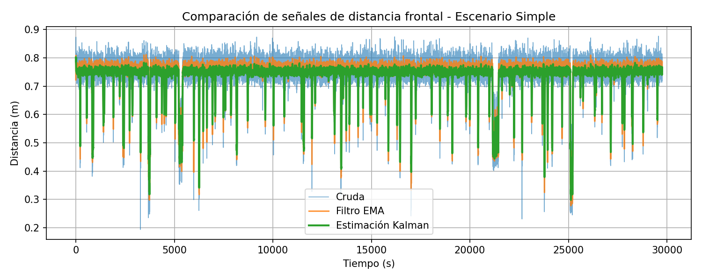
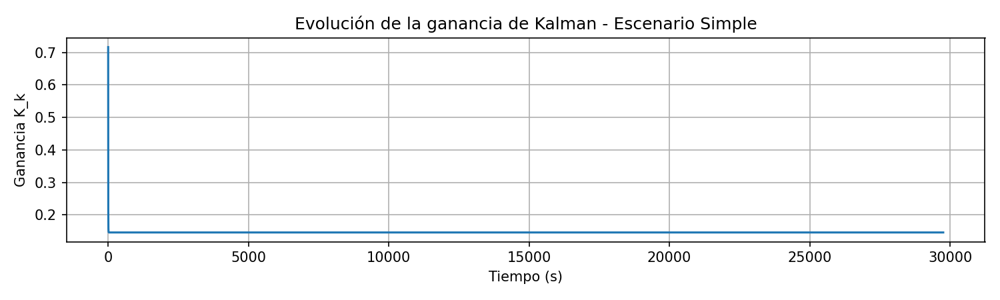
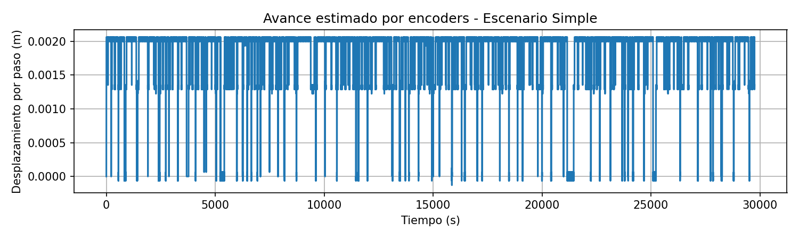
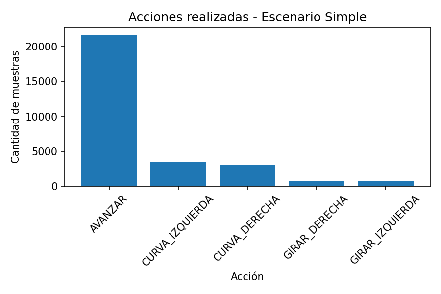
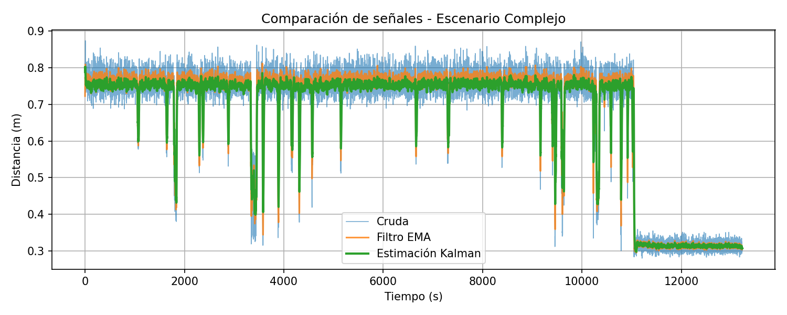
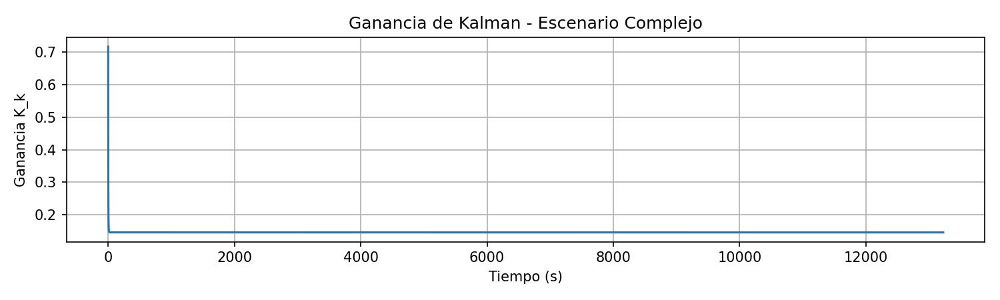
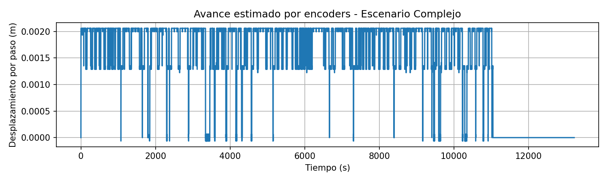
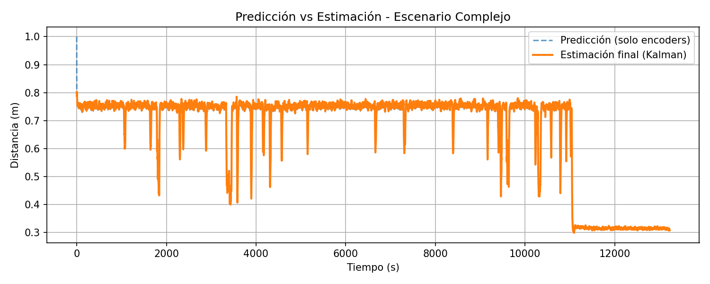
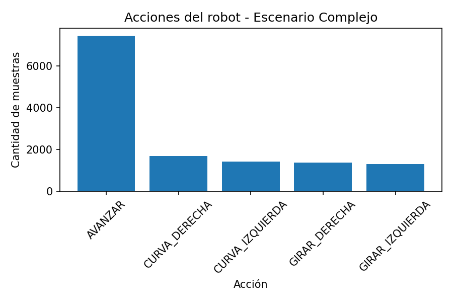

# Laboratorio-2-Robótica
Integrantes:
- Benjamín Velásquez
- Hector Fuentes
- Diego Escobar
- Fernanda Cádiz

# Objetivo
Implementar un sistema básico de navegación reactiva en Webots utilizando un robot móvil diferencial e-puck, empleando sensores de distancia y encoders de rueda para percibir el entorno y estimar el movimiento del robot.

Además, se busca aplicar técnicas de filtrado y fusión sensorial mediante un filtro simple y un filtro de Kalman, con el propósito de obtener una estimación más estable y confiable de la distancia frontal a obstáculos, mejorando así la toma de decisiones durante la navegación autónoma y la evitación de colisiones.

# Robot utilizado
Se utilizó el robot móvil diferencial e-puck disponible en Webots. Este robot cuenta con dos ruedas motrices independientes, sensores de proximidad y encoders en sus ruedas, lo que permite implementar navegación autónoma y estimación de movimiento.

# Sensores utilizados
Se utilizaron sensores de proximidad y encoders de rueda.

Los sensores frontales utilizados fueron ps0 y ps7, los cuales permiten estimar la distancia frontal al obstáculo más cercano.

Los sensores laterales utilizados fueron ps1, ps2, ps5 y ps6. Estos sensores permiten detectar obstáculos ubicados a los costados del robot y decidir hacia qué lado realizar el giro.

También se utilizaron los encoders izquierdo y derecho, correspondientes a left wheel sensor y right wheel sensor, para estimar el avance del robot a partir del giro de sus ruedas.

# Frecuencia de muestreo
La frecuencia de muestreo se obtuvo a partir del timestep básico de Webots mediante:

TIME_STEP = int(robot.getBasicTimeStep())

En el controlador se indica que el timestep utilizado por defecto es de 32 ms. Por lo tanto:

Ts = 0.032 s

fs = 1 / Ts = 31.25 Hz

Todas las señales fueron registradas utilizando este mismo periodo de muestreo.

# Navegación reactiva
La navegación se basa en la distancia frontal estimada mediante el filtro de Kalman.

Si la estimación es menor o igual al umbral de obstáculo definido, el robot realiza un giro para evitar la colisión.

Si el obstáculo está más cercano por el lado izquierdo, el robot gira hacia la derecha. Si el obstáculo está más cercano por el lado derecho, el robot gira hacia la izquierda.

Además, cuando los sensores laterales detectan una pared cercana, el robot realiza una curva suave para corregir su trayectoria.

Las acciones registradas por el controlador son:

- AVANZAR
- GIRAR_DERECHA
- GIRAR_IZQUIERDA
- CURVA_DERECHA
- CURVA_IZQUIERDA

# Filtro simple
Se aplicó un filtro exponencial simple EMA sobre la distancia frontal obtenida desde los sensores ps0 y ps7.

La expresión utilizada fue:

valor_filtrado = alpha * valor_nuevo + (1 - alpha) * valor_anterior

En el controlador se utilizó alpha = 0.3.

Este filtro permite suavizar las variaciones bruscas de las mediciones crudas, reduciendo el efecto del ruido antes de utilizar la información para la navegación.

# Filtro de Kalman
Se implementó un filtro de Kalman escalar para estimar la distancia frontal al obstáculo más cercano.

La etapa de predicción utiliza el avance estimado mediante los encoders de las ruedas. En el controlador, el avance se calcula convirtiendo el cambio angular de cada rueda en desplazamiento lineal mediante:

s = r * theta

Luego se promedia el desplazamiento de ambas ruedas.

La etapa de corrección utiliza la distancia frontal medida por los sensores ps0 y ps7. El filtro combina la predicción basada en movimiento con la medición de los sensores para obtener una estimación más estable de la distancia frontal.

Los parámetros utilizados fueron:

Q = 0.01

R = 0.4

# Escenarios de prueba
Se diseñaron dos escenarios en Webots para evaluar el comportamiento del robot:

- Escenario simple: Entorno con pocos obstáculos, principalmente un obstáculo frontal y espacio abierto. Permite analizar la respuesta básica del sistema de navegación reactiva.

- Escenario complejo: Entorno con múltiples obstáculos y pasillos estrechos. Representa una situación más desafiante donde el robot debe realizar giros y curvas continuamente para evitar colisiones.

En ambos escenarios se registraron las señales de distancia frontal (cruda, filtrada con EMA y estimada por Kalman), la ganancia de Kalman, el avance por encoders y las acciones ejecutadas.

# Resultados
### Escenario simple

#### Comparación de señales de distancia frontal

*Figura 1: Distancia frontal cruda, filtrada con EMA y estimada por Kalman en los primeros segundos del escenario simple.*

Durante los primeros 1.152 segundos, la distancia cruda oscila entre 0.72 y 0.87 m, con fluctuaciones rápidas. El filtro EMA suaviza las variaciones, mientras que la estimación de Kalman (que parte de 0.80 m) se estabiliza rápidamente alrededor de 0.75–0.76 m, con una dispersión mucho menor. Esto demuestra que el filtro de Kalman, al fusionar la predicción por encoders (avance constante de 0.00206 m/paso) con la medición, logra una estimación más estable que cualquiera de las señales individuales.

#### Ganancia de Kalman

*Figura 2: Evolución de la ganancia de Kalman en el escenario simple.*

La ganancia comienza en 0.716 y disminuye rápidamente a 0.146 en menos de 1 segundo, manteniéndose estable en adelante. Esto indica que el filtro parte con alta incertidumbre y, al recibir mediciones consistentes, incrementa su confianza en la predicción, reduciendo el peso de la medición.

#### Avance por encoders

*Figura 3: Desplazamiento lineal por paso a partir de los encoders.*

El avance es constante (0.00206 m por paso), reflejando que el robot se desplaza a velocidad uniforme durante todo el experimento. No se observan variaciones asociadas a giros en este tramo.

#### Acciones realizadas

*Figura 4: Distribución de acciones en todo el escenario simple.*

Predomina la acción `AVANZAR`, con algunas curvas y giros esporádicos, lo cual es coherente con un entorno de baja densidad de obstáculos.

### Escenario complejo

#### Comparación de señales de distancia frontal

*Figura 5: Distancia frontal cruda, filtrada con EMA y estimada por Kalman en el escenario complejo.*

Las señales cruda y EMA se mantienen constantes en 0.76 m, indicando que los sensores frontales están saturados o no detectan cambios. En cambio, la estimación de Kalman aumenta linealmente de 0.76 m a 0.87 m, reflejando que el robot se aleja del obstáculo frontal. Esta tendencia es capturada gracias a la predicción por encoders (movimiento de avance), demostrando la ventaja de la fusión sensorial.

#### Ganancia de Kalman

*Figura 6: Evolución de la ganancia de Kalman en el escenario complejo.*

La ganancia parte en 0.72 y cae bruscamente a 0.02, permaneciendo baja. Esto significa que el filtro confía casi exclusivamente en la predicción por encoders, ignorando la medición frontal constante y poco fiable.

#### Avance por encoders

*Figura 7: Desplazamiento lineal por paso en el escenario complejo.*

Nuevamente, el avance es constante (≈0.0018 m/paso), confirmando velocidad uniforme.

#### Predicción vs estimación final

*Figura 8: Comparación entre la predicción (solo encoders) y la estimación final de Kalman.*

En un punto intermedio, la predicción cae abruptamente a 0.31 m (posible error de deslizamiento o acumulación de encoders), pero la estimación de Kalman se mantiene estable y en aumento (0.76 → 0.87 m) porque la ganancia es muy baja (0.02). Esto evita una maniobra errónea de giro.

#### Acciones realizadas

*Figura 9: Distribución de acciones en el escenario complejo.*

Se observa una variedad de acciones: `AVANZAR`, `CURVA_DERECHA`, `CURVA_IZQUIERDA`, `GIRAR_DERECHA` y `GIRAR_IZQUIERDA`. Esto refleja la necesidad de correcciones continuas en pasillos estrechos.

### Comparación de estrategias de navegación
Para evaluar la mejora aportada por el filtro de Kalman, se comparó el comportamiento del robot en el escenario complejo utilizando tres fuentes de información para la toma de decisiones:

| Estrategia | Fuente de distancia frontal | Comportamiento observado |
|------------|----------------------------|--------------------------|
| **Solo señales crudas** | `front_m_raw` (medición directa) | El robot reacciona a cada fluctuación de ruido. En el escenario complejo, como la señal cruda es constante (0.76 m), el robot nunca giraría al frente, pero sí reacciona a ruidos puntuales que pueden generar giros innecesarios. |
| **Solo filtro EMA** | `front_filtered` | Reduce el ruido de alta frecuencia, pero sigue dependiendo de la medición directa. En el escenario complejo, la señal EMA también es constante (0.76 m), por lo que el robot no detecta el alejamiento del obstáculo. |
| **Fusión con Kalman** | `kalman_estimate` | Combina la predicción por encoders con la medición. En el escenario complejo, logra estimar el aumento real de la distancia (0.76 → 0.87 m) y evita falsas alarmas por la caída abrupta de la predicción de encoders. El robot navega de forma más suave y segura. |

**Conclusión de la comparación:**  
La estrategia basada en el filtro de Kalman es superior cuando los sensores directos presentan saturación o ruido, ya que incorpora información de movimiento. En entornos con mediciones confiables (escenario simple), las tres estrategias funcionan aceptablemente, pero Kalman ofrece la mejor estabilidad.

# Conclusiones
- Se logró implementar completamente el sistema de navegación reactiva con filtro de Kalman, cumpliendo los objetivos del laboratorio.
- El filtro simple (EMA) reduce el ruido, pero no puede fusionar información de movimiento.
- El filtro de Kalman escalar demostró ser robusto: en el escenario simple entregó estimaciones estables y suaves; en el complejo, donde los sensores frontales se saturaron, confió en la predicción por encoders y evitó decisiones erróneas.
- La ganancia de Kalman se ajustó automáticamente: alta al inicio (incertidumbre) y baja cuando la predicción fue confiable.
- Los encoders proporcionaron un avance constante y útil, aunque se detectó una anomalía en la predicción del escenario complejo (caída a 0.31 m), la cual fue correctamente ignorada por el filtro.
- La combinación de sensores laterales y distancia frontal estimada permitió al robot evitar colisiones en ambos escenarios, mostrando un comportamiento más estable que si se hubieran usado señales crudas.

# Cómo ejecutar el proyecto 

1. Instalar Webots.
2. Clonar o descargar el repositorio desde GitHub.
3. Abrir el archivo del mundo ubicado en la carpeta worlds.
4. Seleccionar el controlador correspondiente al laboratorio.
5. Ejecutar la simulación utilizando el botón Run de Webots.
6. Al finalizar la simulación, revisar el archivo sensor_log.csv generado automáticamente para analizar las señales registradas.
